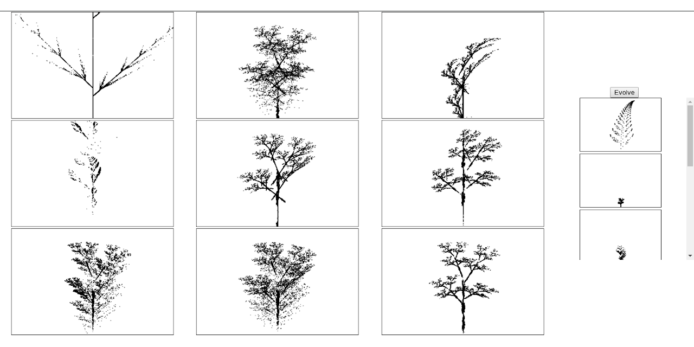
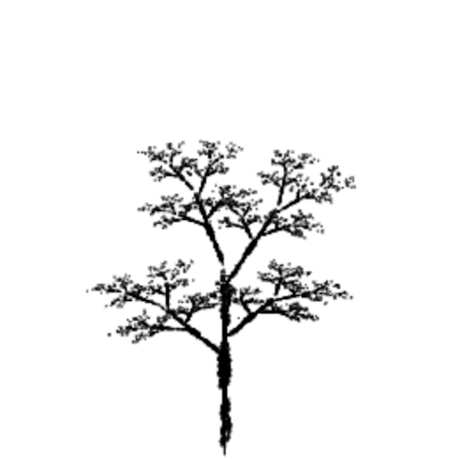
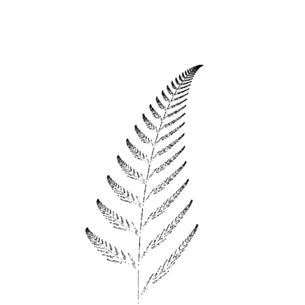

# Random Fractal

...or the secret behind my tree.

[live version](https://victorribeiro.com/randomFractal)

## About

Every once in a while someone asks me about the tree on the background of my homepage, this project tries to tell a little bit about it.

Back in college I got really interested in fractals and didn't took me long enough to find Keith Peters's book - [Playing with chaos](http://www.playingwithchaos.net/). I bought the e-book and fell in love with it right away. Not also it explains a lot of fractals, it does so using JavaScript and Canvas, two things I really love. I still learn a lot from that book. Anyway, about the tree: as soon as I saw that beautiful siluete of a tree forming with a couple of rules, I decided to use it on my homepage. If you wanna know more about fractals I highly suggest you to buy the e-book aswell.

## The Rules used in this project

Parent A

Parent B

Since I cannot create my own rules, I took the rules I used to create the tree and a rule to create a leaf and decided to cross them, as you'd do with a plant if you wanna make a new specie. So, every time you click / touch the screen, a new fractal emerge from that crossing.

